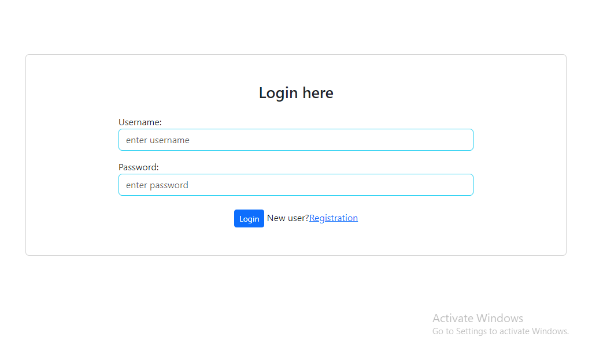
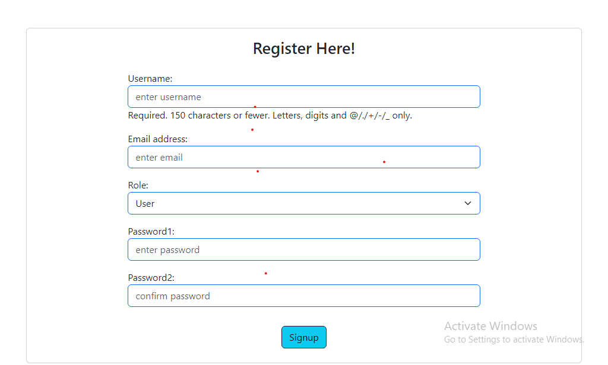
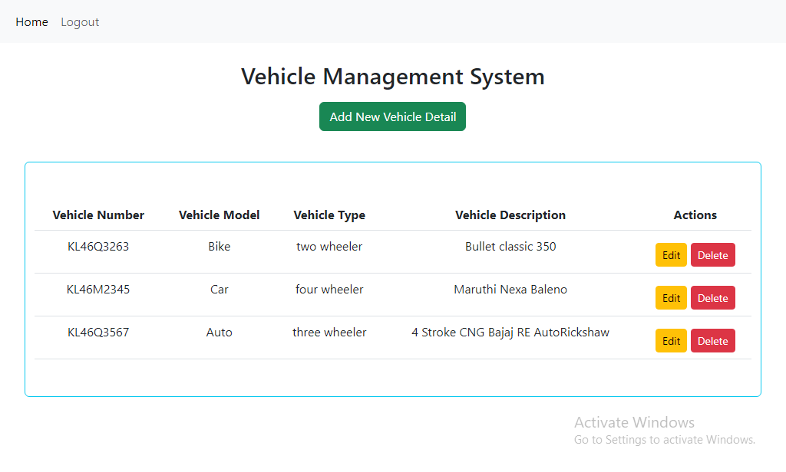
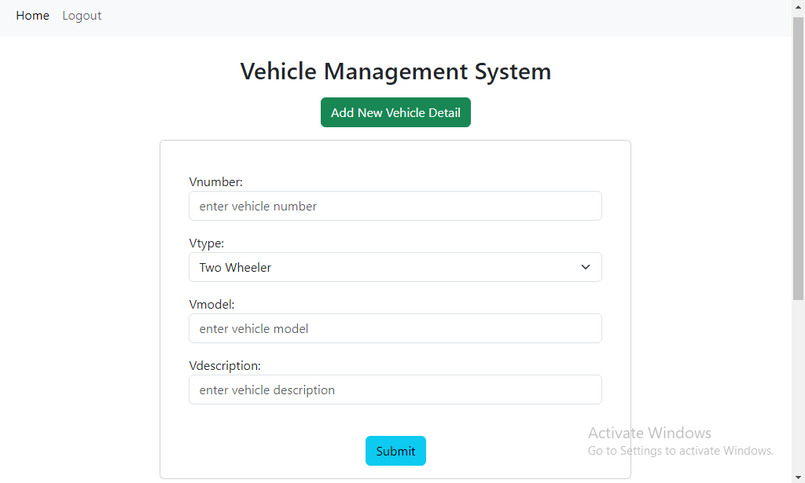
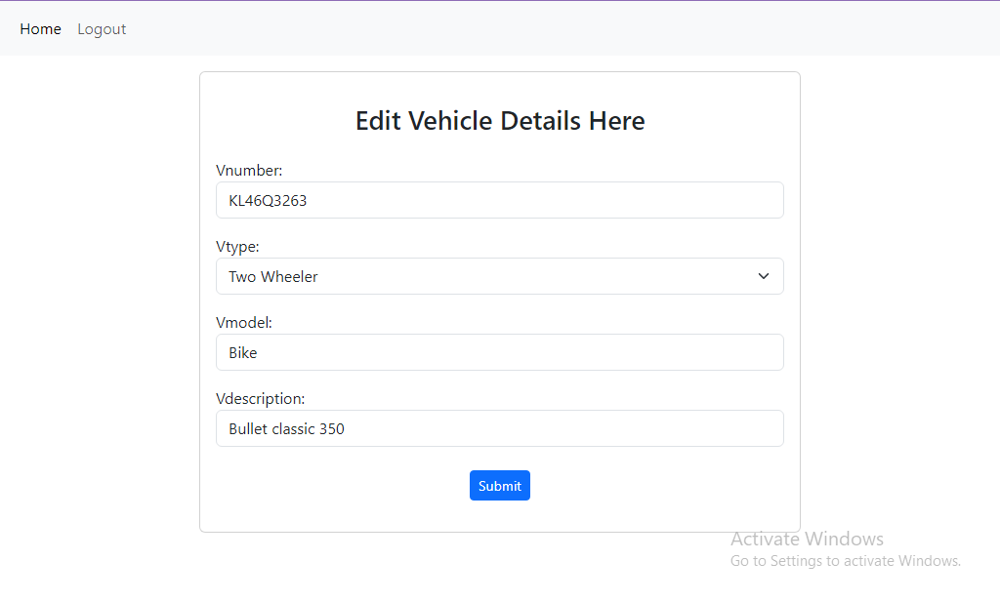
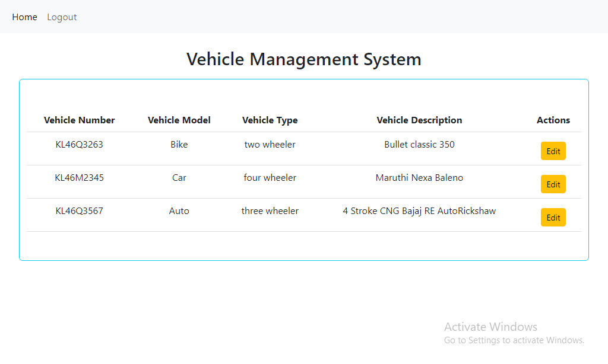
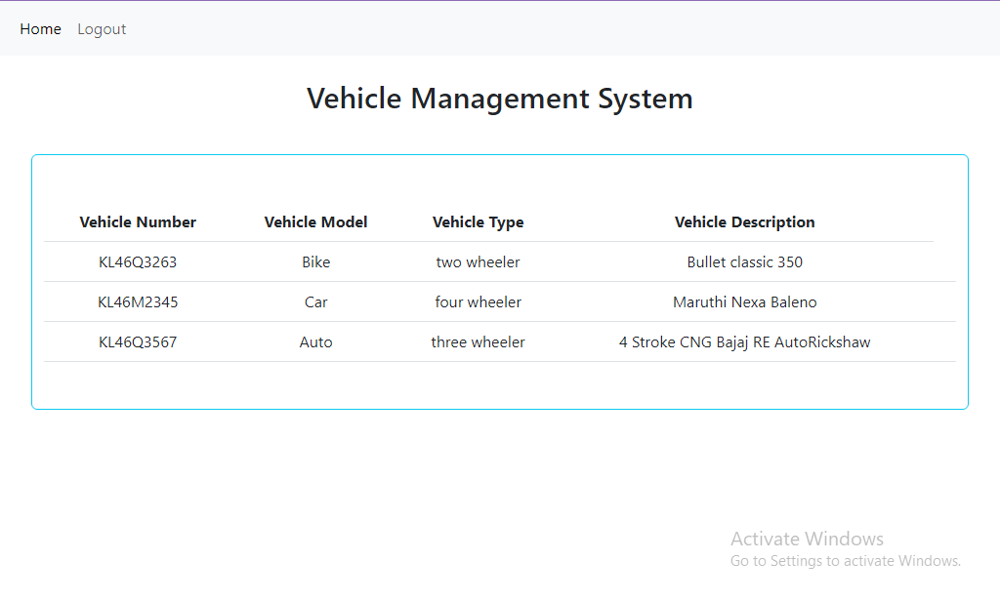

# Vehicle Management System

Vehicle management system is a web application for storing details of vehicle's - vehicle number, vehicle type, vehicle model and vehicle description.
It keeps track of records of all vehicle's details created by super-admin. 

**Project Specifications**

* Implimented Generic views.
* Used SQLite database.

Also created a user access management system. There are three type of roles for the user.

1. Super-admin 
2. Admin 
3. User 

Here **Super-admin** can perform all the operations (CRUD). **Admin** can only edit and view the details and a **User** is restricted for everything except viewing the Vehicle's details.

List of details of user's i have created are listed below.

|Username|Password|Role|
|----|----|----|
|athul@22|password@22|Super-admin|
|athul@33|password@33|Admin|
|athul@44|password@44|User|
|athul@55|password@55|Super-admin|
|athul@66|password@66|Admin|
|athul@77|password@77|User|

**Technologies Used**

* Bootstrap v5.3.0
* Django v4.1

**Project Images View By Super-admin**

**Home View by Admin**

**Home View by User**

